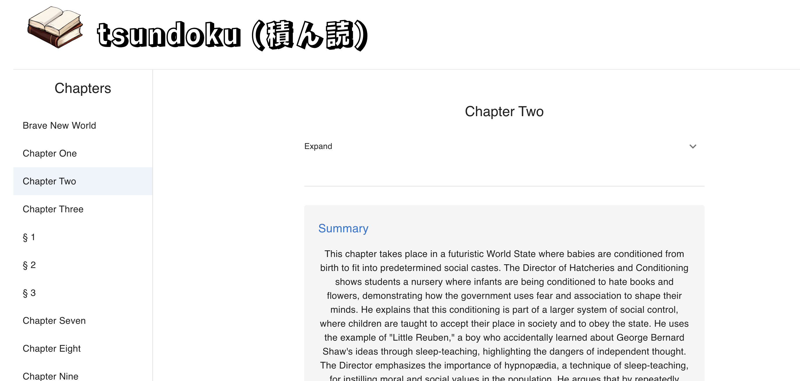

# tsundoku

Tsundoku is a Japanese word that describes the practice of buying books and leaving them unread. It can also refer to the books themselves that are piled up. The goal of this project is to help ease the burden of buying books and leaving them unread - even if that means just summarizing chapters and snippets of the book.

Currently only `epub` files are supported.

**TODO: Add support for other file types.**


Summarize a chapter in real-time using your Groq large language model of choice. It is highly recommended to use the `gemma2-9b-it` model for the best results since the context window is much larger than other models currently available.



---

## Getting Started

These instructions will get you a copy of the project up and running on your local machine for development and testing purposes.

## Quick Start

```bash
cp .env.sample .env  # Edit the .env file with your own values
make build && makerun
```

## Makefile Commands

Build the application:

```bash
make build
```

Start the application:

```bash
make run
```

Start only the database container and run migrations:

```bash
make db
```

Stop all containers:

```bash
make stop
```

Completely destroy all containers, volumes, and images:

```bash
make destroy
```
